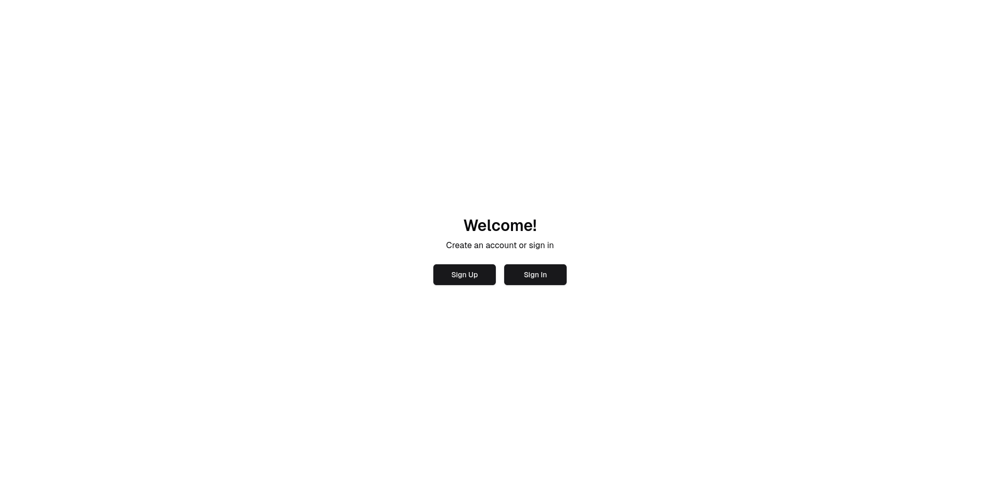
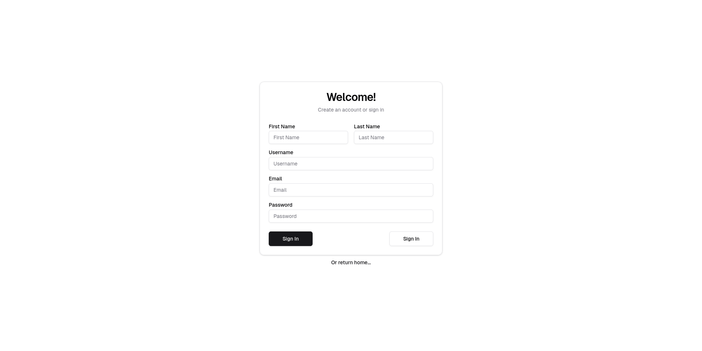
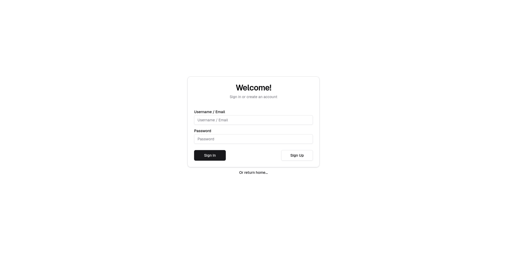
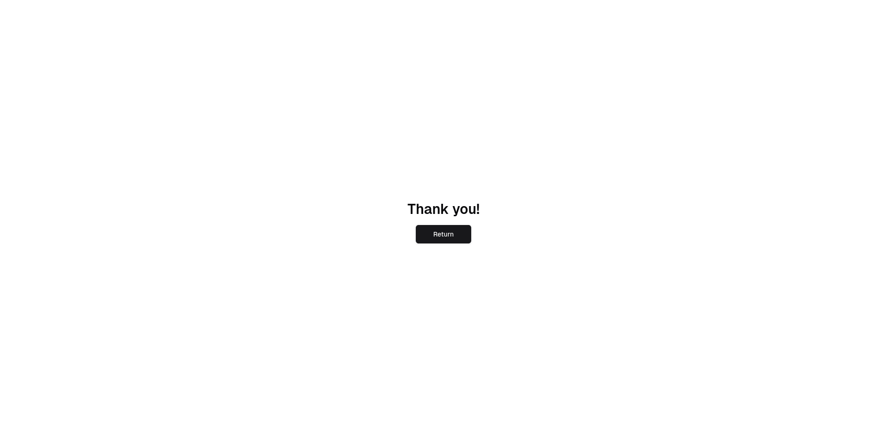

# Simple Authentication Pagination (Front-End Only)

This repository presents a minimalist yet user-friendly authentication interface built with **[Next.js 15](https://nextjs.org/ "NextJS")**, **[TypeScript](https://www.typescriptlang.org/docs/ "TypeScript")**, **[TailwindCSS](https://tailwindcss.com/ "TailwindCSS")**, and **[Shadcn UI](https://ui.shadcn.com/ "Shadcn UI")** components.

The project consists of four primary pages:

### Welcome Page

**Welcome Page** presents users with two options: creating a new account or signing in to an existing one. These options are accessible through dedicated buttons.

### Sign-Up Page

The **Sign-Up Page** presents a streamlined registration process within a minimalist card component. Users are prompted to input their first name, last name, desired username, email, and password. For those who prefer to sign in to an existing account, a sign-in button is available, which transitions to a warning **Red-600** background when hovered. Additionally, a return home link is provided for users who wish to navigate back to the main page.

### Sign-In Page

The **Sign-In Page** employs a similar design to the **Sign-Up Page**, utilizing the same card and button components, including the back buttons. To sign in, users are required to input their username or email address, along with their password.

### Thank You Page

The **Thank You Page** is a confirmation page displayed after successful registration or sign-in. A return button allows users to navigate back to the **Welcome Page**.

